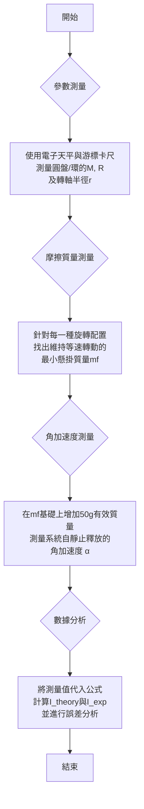

---
tags:
  - lab-report
  - Physics
related:
  - "[[Moment of inertia|轉動慣量]]"
---
# 旋轉系統實驗報告

**作者:** 宋庭睿、陳宥霖、張宸瑞、黃崇恩、潘彥丞  
**所屬機構:** 國立屏東大學應用物理系

---

## 一、摘要

本實驗旨在探討旋轉運動定律（$\tau = I\alpha$），核心問題為如何透過實驗精確測定不同幾何形狀物體的轉動慣量。
實驗方法採用一套旋轉裝置，透過測量懸掛物體驅動下系統產生的角加速度，並建立包含摩擦力效應的動力學模型進行分析。
實驗結果得出，平躺圓盤、直立圓盤及平躺圓環的轉動慣量實驗值分別為 $0.0126 \, \text{kg} \cdot \text{m}^2$、$0.00556 \, \text{kg} \cdot \text{m}^2$ 與 $0.00631 \, \text{kg} \cdot \text{m}^2$，與理論值的相對誤差分別為25.1%、10.3%和26.2%。
本實驗成功驗證了旋轉理論，並確認轉動慣量作為物體旋轉慣性量度的物理意義，其誤差分析也為未來相關實驗的改進提供了方向。

---

## 二、緒論

### 背景
轉動，作為自然界與工程技術中最普遍的運動形式之一，其動力學原理的研究構成了古典物理學的基石。
從行星的公轉、電子的自旋，到馬達的轉子與陀螺儀的導航，旋轉現象無所不在。
十八世紀，歐拉等物理學家在牛頓運動定律的基礎上，將其從線性運動推廣至旋轉運動，建立了以力矩、角加速度及轉動慣量為核心的旋轉動力學理論。
其中，轉動慣量（Moment of Inertia）是一個描述物體抵抗其旋轉狀態改變能力的物理量，其角色相當於線性運動中的質量。
它不僅取決於物體的總質量，更與質量相對於轉軸的分佈密切相關。
因此，精確測定一個物體的轉動慣量，對於理解其動力學特性、設計精密的機械系統（如飛輪、離心機）以及驗證物理理論都至關重要。
本實驗即是建立在這一深厚的理論背景之上，透過基礎的實驗操作，重現並驗證此一核心物理概念。

### 目的
1.  透過測量旋轉系統在固定力矩作用下的角加速度，以驗證旋轉運動定律 $\tau_{net} = I\alpha$。
2.  計算圓盤與圓環在不同轉軸配置下的實驗轉動慣量，並與理論值進行比較。
3.  分析實驗過程中可能存在的系統誤差與隨機誤差來源。

---

## 三、實驗原理

### 理論基礎
旋轉動力學的核心在於牛頓第二定律的旋轉形式：$\tau_{net} = I\alpha$。此定律表明，作用於剛體上的淨力矩（$\tau_{net}$）等於該剛體的轉動慣量（$I$）與其角加速度（$\alpha$）的乘積。
轉動慣量是剛體轉動慣性的量度，對於一個由離散質點組成的系統，其定義為 $I = \sum m_i r_i^2$；對於連續質量分佈的物體，則需透過積分計算。

### 公式與定律
1.  **理論轉動慣量**:
    -   圓環 (軸過質心): $I_{theory} = \frac{1}{2} M (R_1^2 + R_2^2)$
    -   圓盤 (軸過質心): $I_{theory} = \frac{1}{2} M R^2$
    -   圓盤 (軸為直徑): $I_{theory} = \frac{1}{4} M R^2$

2.  **實驗轉動慣量推導**:
    本實驗的轉動慣量 $I_{exp}$ 是透過連結「懸掛物質量的直線運動」與「旋轉體的轉動」兩個系統，並共同解其動力學方程式所得。詳細推導步驟如下：

    -   **第一步：分析懸掛物的受力與運動**
        懸掛物（總質量 $m_{total}$）受到向下的重力 $m_{total}g$ 與向上的繩子張力 $T$。根據牛頓第二定律 $F_{net} = ma$，其運動方程式為：
        $$m_{total}g - T = m_{total}a \quad (1)$$

    -   **第二步：分析旋轉體的受力矩與轉動**
        旋轉體受到由繩子張力產生的驅動力矩 $T \cdot r$^[r為轉軸半徑] 與反向的摩擦力矩 $\tau_{摩擦}$。根據轉動的牛頓第二定律 $\tau_{net} = I\alpha$，其運動方程式為：
        $$T \cdot r - \tau_{摩擦} = I_{exp}\alpha \quad (2)$$

    -   **第三步：連結系統並代換**
        從式 (1) 可得 $T = m_{total}(g - a)$，將其代入式 (2) 以消去張力 $T$：
        $$[m_{total}(g - a)] \cdot r - \tau_{摩擦} = I_{exp}\alpha$$

    -   **第四步：引入系統內在關聯**
        由於繩子不可伸長，懸掛物的線加速度 $a$ 與轉軸的角加速度 $\alpha$ 關係為 $a = \alpha r$。
        同時，我們將==動摩擦力矩== $\tau_{摩擦}$ 模型化為一個等效的「摩擦質量」$m_f$ 所產生的力矩，即 $\tau_{摩擦} = (m_f g) r$。^[動摩擦力為定值]
        將這兩個關係代入上式：
        $$[m_{total}(g - \alpha r)] \cdot r - (m_f g r) = I_{exp}\alpha$$

    -   **第五步：整理方程式，解出 $I_{exp}$**
        將上式展開並重新整理，即可分離出 $I_{exp}$：
        $$m_{total}gr - m_{total}\alpha r^2 - m_fgr = I_{exp}\alpha$$
        $$(m_{total} - m_f)gr = I_{exp}\alpha + m_{total}\alpha r^2$$
        $$(m_{total} - m_f)gr = \alpha(I_{exp} + m_{total}r^2)$$
        $$I_{exp} = \frac{(m_{total} - m_f)gr}{\alpha} - m_{total}r^2$$

    -   **最終計算公式**
        在本次實驗中，總懸掛質量 $m_{total}$ 由「摩擦質量 $m_f$」與額外增加的「有效質量 $m_{eff}$」（即 50g）組成，即 $m_{total} = m_f + m_{eff}$。
        將此關係代入，可得更直觀的計算公式：
        $$I_{exp} = \frac{((m_f + m_{eff}) - m_f)gr}{\alpha} - (m_f + m_{eff})r^2$$
        $$I_{exp} = \frac{m_{eff} \cdot g \cdot r}{\alpha} - (m_f + m_{eff})r^2$$

---

## 四、實驗

### 儀器準備與架設
- **儀器清單**: 旋轉主機、智慧計時器、光電閘、圓盤、圓環、砝碼組、滑輪、細繩、電子天平、游標卡尺。
- **儀器架設**: 將旋轉主機置於水平桌面上，調整底座腳墊使轉盤達水平狀態。安裝光電閘於適當高度，確保能偵測到轉盤上的擋光標記。將細繩一端繞於轉軸上，另一端跨過滑輪垂直懸掛砝碼。

### 實驗流程

### 注意事項
1.  **確保水平**: 實驗前必須使用水平儀或透過觀察轉盤靜止狀態，確認旋轉盤面已完全調平，以避免重力分力產生額外力矩。
2.  **細繩切線**: 確保跨過滑輪的細繩與轉軸保持相切，且與滑輪邊緣平行，避免力臂長度不準確。
3.  **摩擦質量判斷**: 測量摩擦質量 $m_f$ 時，應輕推系統使其轉動，觀察其是否能長時間維持近乎等速的狀態，避免將靜摩擦力誤判為動摩擦力。
4.  **釋放一致性**: 每次測量角加速度時，應從相同的高度靜止釋放，以確保初始條件的一致性。

---

## 五、結果與討論

#### 表一、基礎測量參數
| 參數 | 數值 | 單位 |
| :--- | :--- | :--- |
| 重力加速度 ($g$) | 9.8 | m/s² |
| 轉動軸半徑 ($r$) | 0.015 | m |
| 有效質量 ($m_{eff}$) | 0.050 | kg |
| 摩擦質量 ($m_f$) - 平躺圓盤 | 0.020 | kg |
| 摩擦質量 ($m_f$) - 直立圓盤 | 0.015 | kg |
| 摩擦質量 ($m_f$) - 圓盤+圓環 | 0.035 | kg |

#### 表二、轉動慣量計算結果與誤差
| 項目 | 理論值 ($I_{theory}$) | 實驗值 ($I_{exp}$) | 相對誤差 (%) |
| :--- | :--- | :--- | :--- |
| **平躺圓盤** | 0.0101 kg·m² | 0.0126 kg·m² | 25.1% |
| **直立圓盤** | 0.00504 kg·m² | 0.00556 kg·m² | 10.3% |
| **平躺圓環** | 0.00500 kg·m² | 0.00631 kg·m² | 26.2% |

實驗結果顯示，所有實驗值與理論值均在同一數量級，驗證了理論模型的適用性。
其中，**直立圓盤**的實驗誤差（10.3%）顯著低於其他兩組，推測其原因在於此配置下的總轉動慣量最小，系統對摩擦力矩估算不準等誤差因素的敏感度較低。
反之，**平躺圓盤**（25.1%）與**平躺圓環**（26.2%）因轉動慣量較大，任何對摩擦力的不準確估計或加速度測量的微小偏差，都可能被放大，導致較高的誤差。此外，摩擦質量 $m_f$ 的測量本身即為一個簡化模型，實際摩擦力可能並非定值，而是與轉速相關，此模型上的差異是造成系統誤差的主要來源。

---

## 六、結論

### 主要發現
本實驗成功透過動力學方法測得三種不同配置下旋轉體的轉動慣量，實驗值與理論計算值在數量級上相符，驗證了旋轉定律 $\tau = I\alpha$ 的正確性。
數據表明，實驗誤差介於10.3%至26.2%之間，其中轉動慣量較小的系統（直立圓盤）所得結果的準確度較高。

### 改進建議
1.  **優化摩擦力模型**: 未來實驗可嘗試透過變換不同驅動質塊，測量多組 $(\alpha, m_{total})$ 數據，並以線性回歸作圖法求解 $I_{exp}$ 與 $m_f$，以獲得更精確的摩擦力補償。
2.  **降低測量誤差**: 對於角加速度 $\alpha$ 與摩擦質量 $m_f$ 應進行多次獨立測量並取平均值，以降低隨機誤差對實驗結果的影響。

---

## 七、參考資料

[1] 國立屏東大學應用物理系。 (n.d.). *實驗四 旋轉系統實驗*。實驗手冊。
